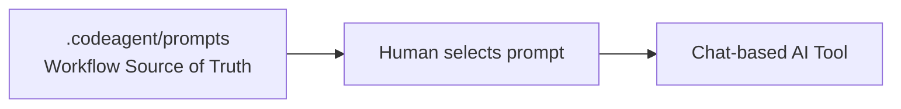

# Generic CodeAgent Integration

This document describes how to use **CodeAgent Kit without a tool-specific adapter**.

This mode is ideal when you work directly with chat-based AI tools and copy/paste prompts manually.

---

## When to use this integration

Use **Generic CodeAgent Integration** if:

* You interact with AI via chat (browser, desktop app, etc.)
* You want full control over what context is sent
* You prefer explicit, copy/paste workflows

No additional tooling is required beyond the embedded kit.

---

## Installation

From your project root:

```sh
bash <(curl -fsSL https://raw.githubusercontent.com/AdarBahar/codeagent-kit/main/scripts/codeagent.sh) install
```

Optional (commit immediately):

```sh
bash <(curl -fsSL https://raw.githubusercontent.com/AdarBahar/codeagent-kit/main/scripts/codeagent.sh) install --commit
```

This adds:

* `.codeagent/prompts/` – workflow instructions
* `.codeagent/current/` – project-specific system state

---

## Daily usage

### 1. Choose the correct prompt

Navigate to `.codeagent/prompts/` and select the workflow you need:

* `plan.md` – planning before implementation
* `implement.md` – executing a reviewed plan
* `run.md` – running tasks or documenting changes
* `audit.md` – reviewing correctness or documentation health

---

### 2. Copy the prompt into your AI tool

Paste the full prompt contents and then add your **project-specific context** below it.

Example:

```text
<contents of plan.md>

Context:
- Feature: Notifications
- Constraints: No schema changes
```

---

### 3. Follow the standard workflow

```
PLAN → IMPLEMENT → RUN → SELF_CHECK
```

For complex or risky changes, insert `AUDIT` or `REVIEW_NODE` before `RUN`.

---

## Prompt discipline (important)

* Do **not** edit `.codeagent/prompts/` in the project
* Treat prompts as vendor code
* If a prompt needs improvement, upstream it into the kit

---

## Architecture overview



---

## Key properties of this integration

* Maximum transparency
* No hidden automation
* Lowest abstraction level
* Works with any AI chat interface

---

## When to move beyond generic integration

Consider a tool-specific adapter (like OpenCode) when:

* You want slash commands or IDE commands
* You want enforced agent separation (plan vs build)
* You want less copy/paste and more structure

See `docs/opencode.md` for the recommended next step.
